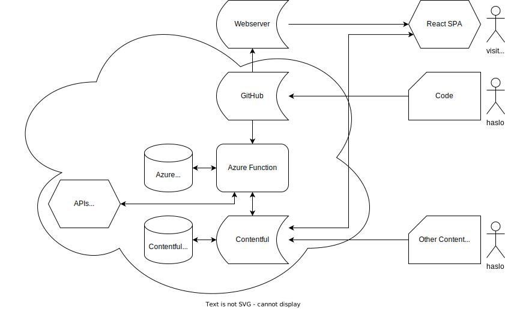

# Content Hub

## Architecture

## Backend

* Contentful, headless
* Connecting through GraphQL API

## React App

* see [REACT.md](REACT.md) for basics
* using [MUI](https://mui.com/) for frontend

## 3rd Party APIs

See [the syncer backend repo](https://github.com/haslo/haslo_hub_syncer), connecting to:

* YouTube
* Soundcloud
* Instagram

Using [Azure App Service](https://azure.microsoft.com/en-us/services/app-service/) for connecting to / filling Contentful
